# BATTLESHIP GAME #


The BATTLESHIP Game is a terminal game which runs in the Code Institute mock terminal on Heroku. The user can challenge the computer in a one-on-one battle but choose one of three challenging levels. A beginner level lets users get familiar with the interface and understand simple game rules. At this level, users have 25 shots available to hit 5 ships. The game board size is reduced to 25 fields, which increases winning chances. An intermediate level builds a 10 by 10 grid, providing 10 boats and 75 shots. Lastly, an expert level utilises the same grid size as the intermediate, but the user has only 50 attempts to hit 20 ships.
Additionally, users can choose between random allocation of ships on the board or manual placement. Moreover, the game consists of many visual additions like game logos, color fonts and line separators to improve user experience. Lastly, the game provides countless hours of fun and entertainment by challenging the user's luck.

Click [HERE](https://battleship-game-one-6bf6c6bf7e50.herokuapp.com/) to visit a live page.


---

## How To Play ##


BATTLESHIP Game is heavily based on traditional pen-and-paper games. The main goal is to destroy all opponent's ships. You can read more about the game on [TheSpruceCRAFTS](https://www.thesprucecrafts.com/the-basic-rules-of-battleship-411069). In this version, users enter their name, which consists of alphabetic letters. Furthermore, users are prompted to choose a difficulty level - this will determine the grid size, num of ships, and shots. 
A beginner level generates a 5 x 5 game board with five boats and 25 available shots. At the intermediate level, users have 10 available ships and 75 bullets, and the game takes place on a 10 x 10 board. Also, an expert level generates a 10 x 10 game board, but users have only 50 shots to destroy 20 boats on this level. Lastly, the user can choose between manual boat placement on the board or random allocation. 
The players can see the location of their ships, which are marked on the board with S. The computer's ships are hidden from the users. The guesses are marked with an X on the board, and misses are marked with a 0. 
To place the ships or shot at the board, players must pass coordinates in the format of 'A1' where A - represents the row name and 1 - the column number. Players win by destroying all of the opponent's ships. 

---

## Features ##


### Current Features ###


1. Game Logo:
    - The users are presented with the game logo at the start of the game.

 

---

2. Game Intro:
    - Introduces the basic game rules to the user
    - Explains the different game difficulty levels
    - Explains game markings


---

3. User decisions:

    1. Start the game:
    - Accepts user's input
    - The users must enter 'Y' or 'y' to start the game. If the user chooses 'N' or 'n', the game will reload 
    - Loads the game
    

    ---

    2. User must choose a username and game level
    - Accepts user's input
    - Sets username
    - Defines game parameters (board size, number of ships and shots)
    

    ---

    3. The user must decide to manually or randomly place ships on the board
    - Accepts user's input 
    - Prints user's board
    

    ---

    4. The users must decide if they want to continue the game when they do not have enough bullets to destroy all remaining ships.
    - Accepts users` input
    - Returns to the game or reloads the game - depending on the user's decision
    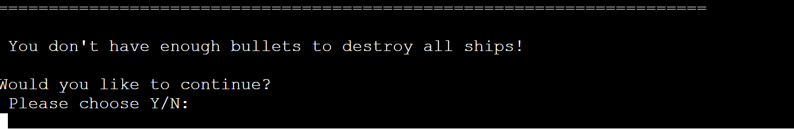

    ---
    5. Users must decide whether to continue the game once they win or lose it.
    - Accepts user's input
    - Reloads the game from the game level choice

    ---

4. Feedback messages:
  - In-game feedback messages are printed in blue to confirm the user's decision choice
  - Feedback answer to Yes or No decision, username choice, game level.
  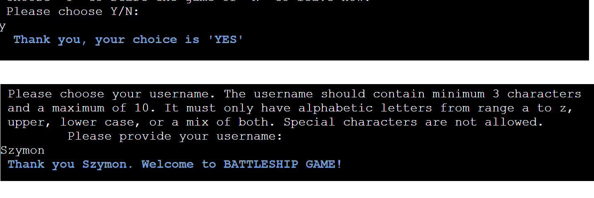
  - Hit shots are printed in green to inform users about successful shot
  - Missed shots are printed in red to inform users

---

5. Manual placement of ship on the board:
  - Prints empty user's board
  - Accepts user's input
  - Adds ships to the board 'S'
  - Informs users about the successful placement of the ship on the board
  - Informs users about remaining ships to place
  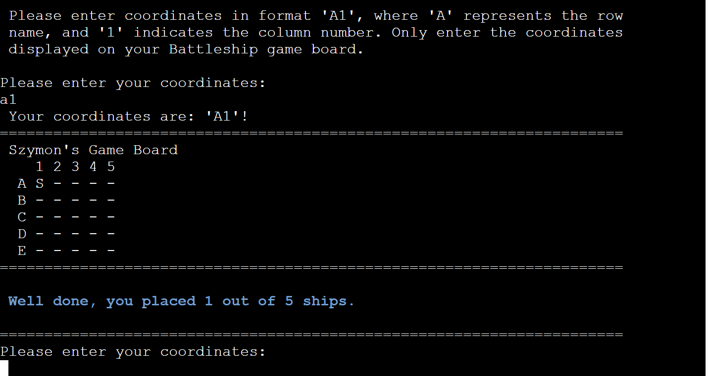
  - Validates the user's choice
  - User must provide coordinates within the gameboard and in the correct format
  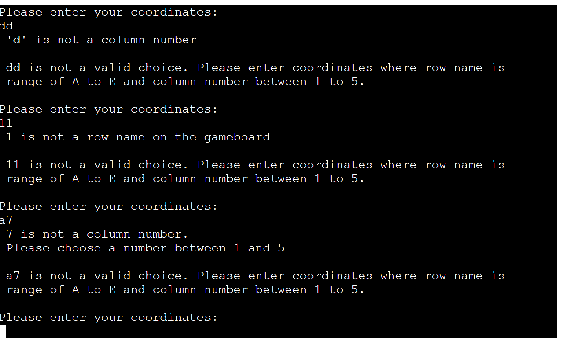

---

6. Random ship placement on the user's board:
  - Prints user's board with ships randomly placed (example below - game level expert)
  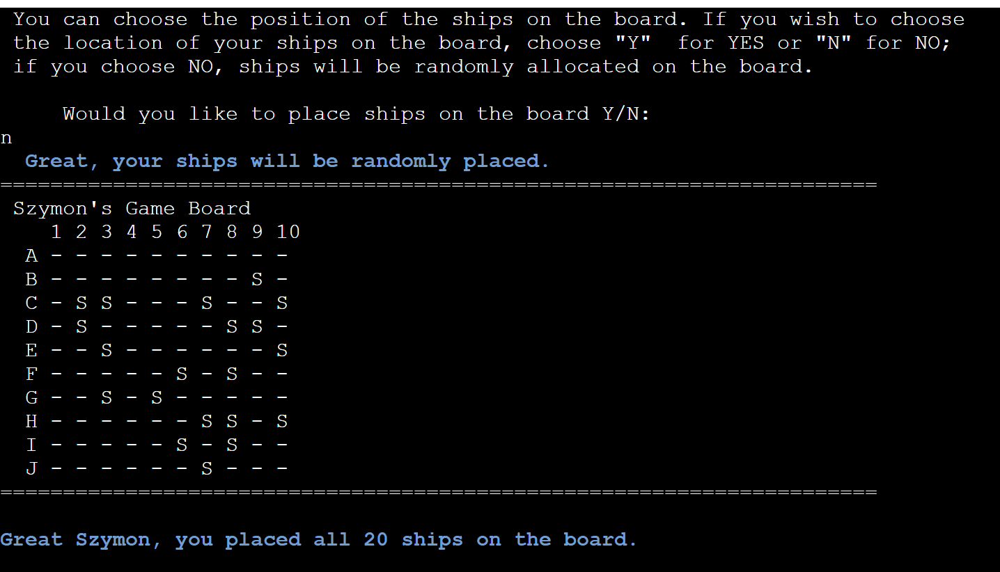

---

7. Battle mode:
  - Accepts user's input 
  - Users shot at the computer board (marked in yellow ink)
  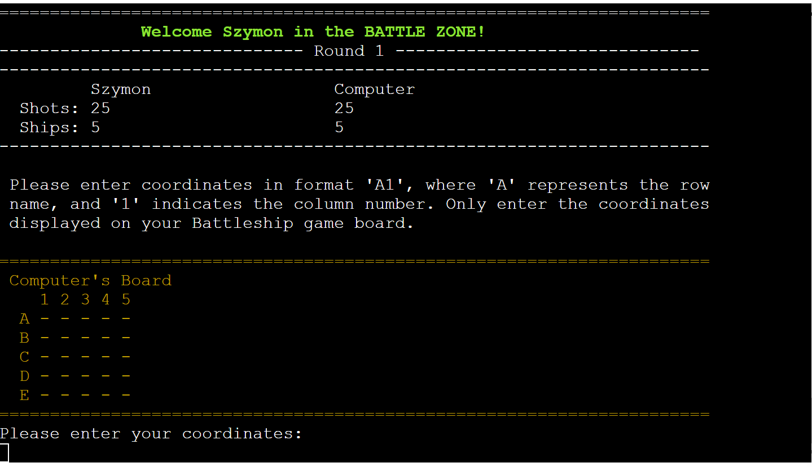
  - Prints feedback message for each hit in bright green color, for each missed in bright red color
  - Confirms users' and computer choices by repeating users` choice
  - Calculates remaining shots and ships
  - Displays the beginning and end of each round
  - Informs user about the possibility of leaving the game early by typing 'stop' into the coordination field at any time of the game - the game will restart
  - Ships are randomly placed on the computer board
  - Hides the location of computer ships
  - Computer shots randomly at the users` board
  - Displays hits on the board as 'X'
  - Displays misses on the board as '0'
  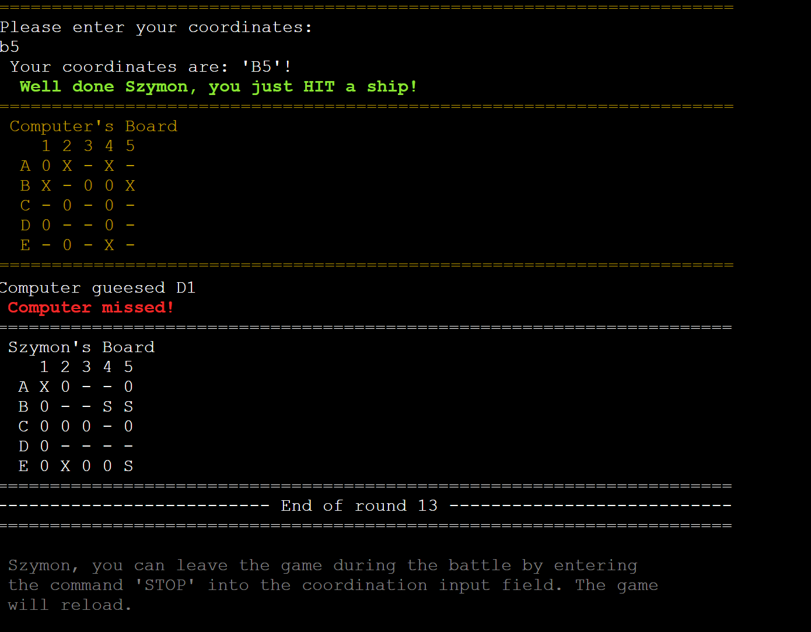

---

8. Winner's message and trophy:
  - Users receive congratulatory messages after destroying all computer ships
  - Users are presented with a bright yellow trophy and the message YOU WIN
  - Users are asked if they wish to continue the game, the game will restart, and the user can choose a difficult level
  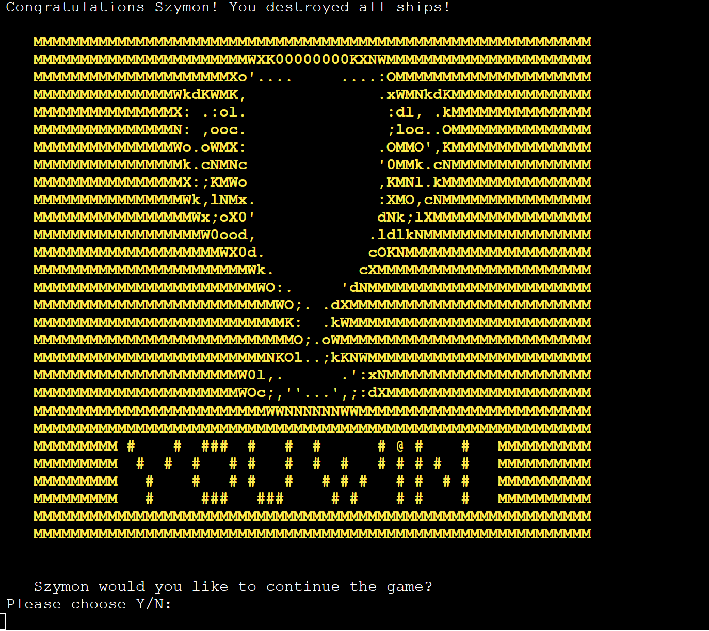

---

9. Game over message:
  - When a user fails to destroy all computer ships, the game over message will appear on the screen
  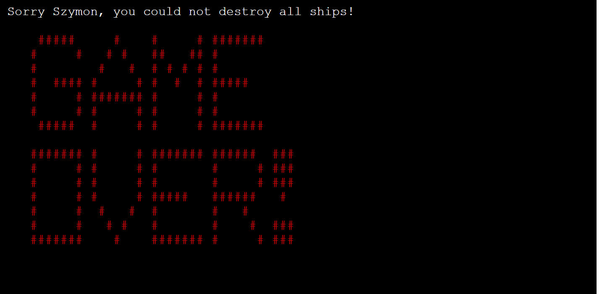

---

10. Low bullets message:
  - Once the number of remaining user's shots is lower than the computer's remaining ships, the user will be given the option to restart the game or to continue anyway
  - The message appears only once.
  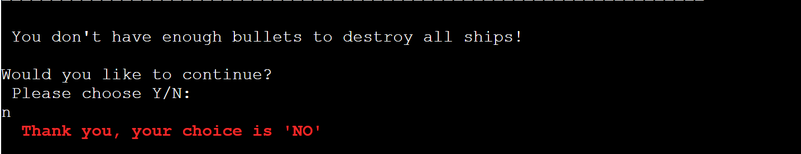

---

11. User input validation:
  - Users can only enter the input permitted by the game parameters. 
    - Only the letter "y, Y, n and N" will be accepted for user decisions where YES or NO answer is required. 
    - The letters "b, B, i, I, e, and E" will be accepted to set the game level. Lastly, the coordinates can be entered as per the board size and in the format where the letter represents a row, and the number indicates a column. For example, A1 or b3. 
    - Alternatively, users can enter stop into the coordinates field to restart the game. The username must be 3 to 10 characters long and accept only alphabetic letters.


### Future Featuers ###


1. Allow the player to choose to board color
2. Allow two players to play against each other
3. Add a reveal function for an expert level to assist the players and allow them to reveal the position of 3 computer ships when low on ammo
4. Allow placing larger ships - as per traditional board
5. Add a master level that takes place on the larger board 15 x 15

---


## Design ##


1. Game flowchart:
  - The game logic was illustrated with the [Lucidchart](https://www.lucidchart.com/pages/) by linking each stage of the game with users' decisions and required operations. Please click details to see the chart. This allowed me to comprehensively understand users' journey through the application and became a foundation for the development

    <details>
    <summary>Click to expand: Battleship Game Lucidchart.</summary>

    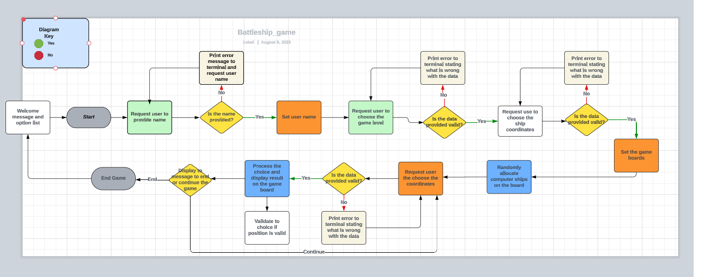

   </details>

2. Data Model:
  - I decided to use a GameBoard class as my model. The game creates two instances of the GameBoard class, one for the players and one for the computer's board. 
  - The GameBoard class stores the game grid size, the number of ships, the number of shots, and the player's name.
  - To assist the game, the GameBoard class has methods such as the `print_board` method that allows printing the current board with row names and column numbers, a method to allow users to add the position of their own ships `add_ships`, or randomly add ships to the board `add_random_ships`. Moreover, the `guess` method allows adding user guesses and returning the result.
  - Moreover, the game has many supporting functions to enhance user experience. For example, `color_print` allows to print out the text in various colors. Also, the `collect_user_name` function collects usernames, which is used to personalise the game. The function `game_level` allows users to choose a difficult level but also defines the board size, number of shots and ships available to play. Similarly, `player_ship_coordinates` help the user to pass boats and shots coordinates against the board. Lastly, `game_battle` ensures that battle mode runs smoothly and allows users to stop the game early and restart the game with an option to choose a difficulty level again.


## Testing ##


I have manually tested this project by doing the following:
- Passed the code through the PEP8 linter and confirmed there are no problems.
- Tested in my local terminal and the Code Institute Heroku terminal.
- Given invalid inputs - see table below for more information:

| Feature | Expected Action| Test Result|
|---------|----------------|------------|
| Game Logo | The game logo will load automatically <details><summary>Click to expand - game logo</summary></details>  | Pass |
| User Decision - Yes or No | User can only pass: n, N, y, Y letters as valid input. Any other answer will display an error message <details><summary>Click to expand - yes or no</summary>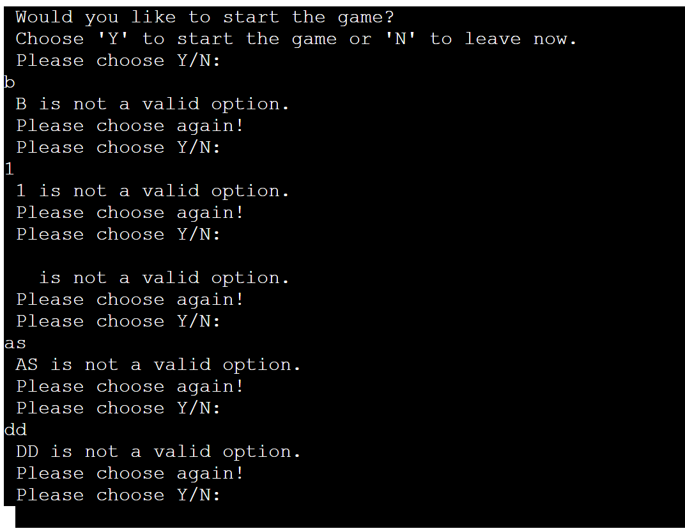</details> | Pass |
| Setting Username | User can only use alphabetic letters to set the username. The username must be minimum 3 characters and maximum 10 <details><summary>Click to expand - username</summary>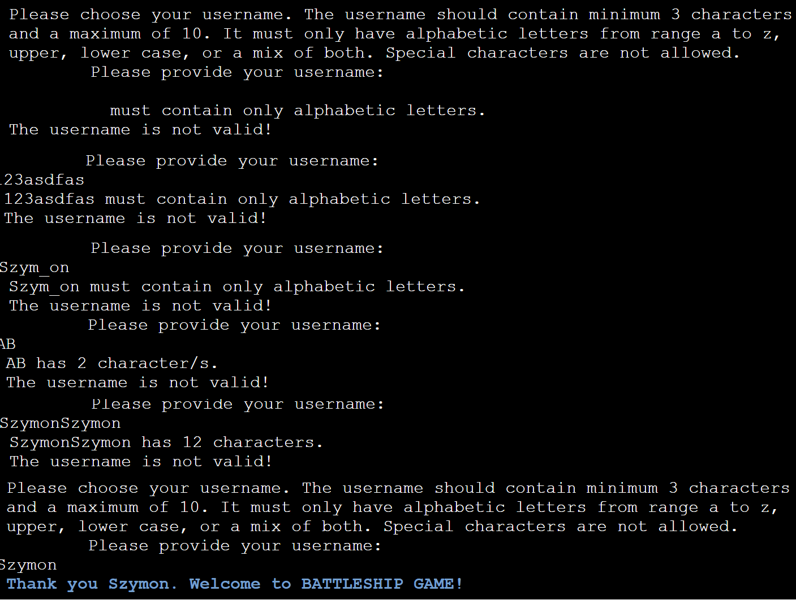</details> | Pass |
| Setting Game Level | User can only enter letters: b, B, i, I, e, and E to set the game level. No other value will be accepted <details><summary>Click to expand - game level</summary>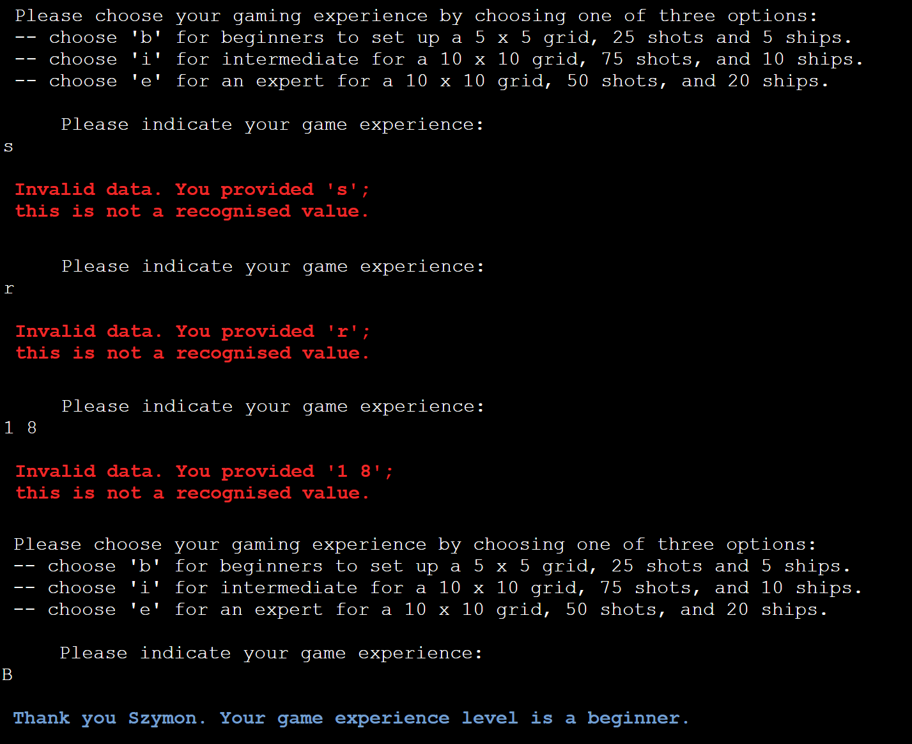</details> | Pass |
| Game Level | Once the User chooses the game level, the game will be set as per instruction in the game brief <details><summary>Click to expand - game parameters</summary></details> | Pass |
| User adds ships | User can only add ships using the coordinates within the game board. Users can enter 'stop' to restart the game. No other value will be accepted <details><summary>Click to expand - adding ships</summary>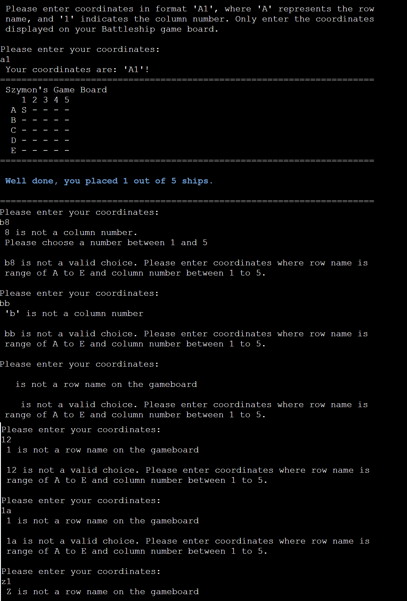</details> | Pass |
| Random Ships Allocation | Users can randomly add ships to the game board. Once done, a message will confirm the successful operation <details><summary>Click to expand - random ships</summary>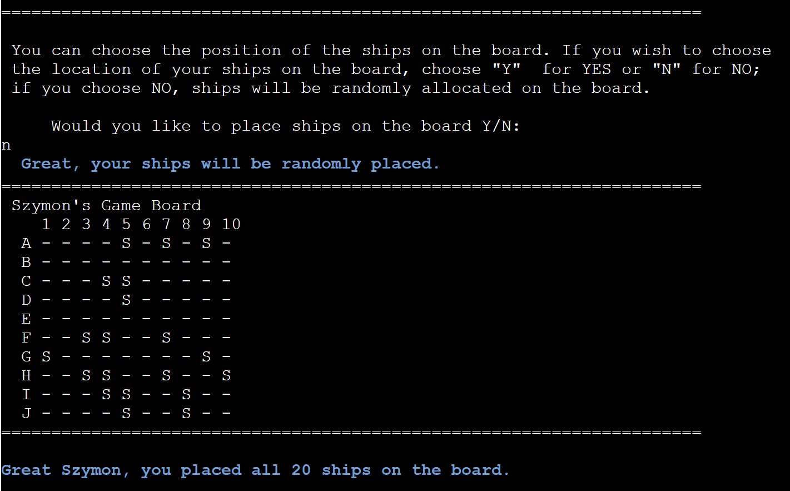</details> | Pass |
| User Shots | User shots against computer board. Hits are marked with 'X' and misses with '0'. The coordinates must be within the board, and the User cannot shoot at the same location twice. <details><summary>Click to expand - random ships</summary>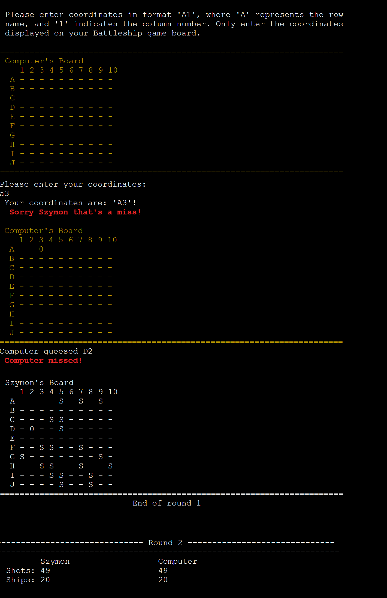</details> | Pass |
| Score Board | The scoreboard displays an updated number of ships and shots after each round | Pass |
| Round Number| The round number change after each shot by one | Pass |
| Restart Game - STOP | Once the word 'stop' is entered into the coordination field, the game reloads from the start. | Pass |
| Low Ammo | The low ammo message will appear to the User when the number of the User's shots is less than that of the computer's ships. User can restart the game and choose a new game level | Pass |
| Trophy | The trophy message will appear to the User once the game is won by sinking all computer ships | Pass |
| Game Over | The game over message will appear to the User once the game is lost due computer sinking all User's ships; the User was not able to sink all computer's ships | Pass |

### Bugs ###

**1. Solved Bugs**

- The function returning value for the column number from the user coordinates input, was returning incorrect number, because I had forgotten to adjust the users input by reducing by 1 to match list index number. 

<details>
<summary>Click to expand - code: before and after</summary>

```py

before:
    if len(data) == 3:
        y = int(data[1] + data[2])
        return y
    else:
        y = int(data[1])

after:
    if len(data) == 3:
        y = int(data[1] + data[2]) - 1
        return y
    else:
        y = int(data[1]) - 1

```

</details>

- When testing `play_game` function, I noticed that function displayed an error, as it could not find value for `username` and `size`. I fixed the problem by passing the `user_name` parameter to game_level function and by passing the `size` parameter to `validate_coordinates` function. This allowed to restric users input to the size of the game board.

<details>
<summary>Click to expand - code: before and after</summary>

```py

before:
    def validate_coordinates(values):

    def game_level():

after:
    def validate_coordinates(values, size):

    def game_level(user_name):

```

</details>

**2. Remaining Bugs**
- No bugs remaining.


### Validator Testing ###

- PEP8
    - No errors were returned from [PEP8Validator](https://pep8ci.herokuapp.com/)

    <details>
    <summary>Click to expand - code validator</summary>

    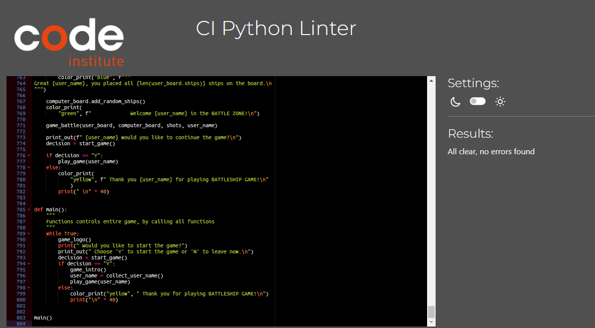

    </details>


## Local Development ##

To bring down project for local development, it is possible to clone a repository by following steps below:
- On [GitHub](https://github.com), navigate to the main page of the repository.
- Above the list of files, click the green button Code.
- Select Local tab.
- Copy to HTTPS code.
- In your local IDE open terminal, choose the location where you want to clone the directory.
- Type git clone and then paste the URL you copied from GitHub.
- Press Enter to create the clone.

Alternatively, you can fork a GitHub repository. Remember that if you forked the repository, none of the updates made to the source repo would be reflected in your forked repo. To fork the repository, follow the steps below:
- Log in to your GitHub account.
- Go to the repository you want to fork.
- In the top right corner of the window, click on the Fork button.
- The process will start, and you will see the message confirming the start.


## Deployment ##


This project was deployed using Code Institute's mock terminal for [Heroku](https://www.heroku.com/).

- Steps for deployment:
    - Fork or clone this reposistory (see Local Development for instructions)
    - Go to Heroku page, login or sign up for new account [Heroku](https://www.heroku.com/)
    - Create a new Heroku App
    - Choose the unique app name and region
    - Go to the Setting tab, in section Config Vars, click on Reveal Config Vars and enter in field for key - `PORT` and the value is `8000`
    - Next, you must add couple of Buildpacks, click on Add Buildpack in excatly this order `python` first, `nodejs` second
    - Go to Deploy tab and choose deployment method GitHub, and connect to GitHub
    - Find the battleship-game repository and connect
    - Click on Deploy Branch (Manual deploy)
    - If you wish that app was update everytime you push the changes to the GitHub, Enable Automatic Deploys

- You can follow the link https://battleship-game-one-6bf6c6bf7e50.herokuapp.com/ to vist deployed application or click [Play Battleship](https://battleship-game-one-6bf6c6bf7e50.herokuapp.com/) and enjoy the game!


    ## Credits ##


- **Inspiration**
    - Firstly, I would like to thank Code Institute for reminding me about this wonderful game that I spent countless hours palying as a kid. This brought so many good memomories, and I had wonderful time building this project. So thank you Code Institute!

    - Also, big thanks to [TheSpruceCRAFTS](https://www.thesprucecrafts.com/the-basic-rules-of-battleship-411069) for reminding me the rules of the game, and providing description.

- **Code**
    - Firstly, thanks to the Tutor of Code Institute, Sean, for helping me out improving the board printing function to ensure that row names and column numbers correspond to the board size.
    - Next, [ASCII Art Archive](https://www.asciiart.eu/ascii-one-line) for providing inspiration for the game logos, which helped improve the visual effects of the application.
    - Also, [ascii-art-generator.org](https://www.ascii-art-generator.org/) helped me to change regular writing into ASCII art but also convert the trophy logo downloaded from [pixabay](https://pixabay.com/vectors/search/trophy/).
    - Moreover, various contributors to [stackoverflow](https://stackoverflow.com/questions/10019456/usage-of-sys-stdout-flush-method) for providing basis and assist in developing print_out function by utilising `syst.stdout.flush()` method.
    - Furthermore, thank you to [pypi.org](https://pypi.org/project/colorama/) for adding color to my project by providing access to the library and explaining its functionality.
    - Lastly, and most importantly, I would like to thank you,, Matt,, at [Code Institute](https://codeinstitute.net/ie/full-stack-software-development-diploma/?hsa_acc=8983321581&hsa_cam=14304747355&hsa_grp=1152289077037598&hsa_ad=&hsa_src=o&hsa_tgt=kwd-72018717753321:loc-92&hsa_kw=code%20institute&hsa_mt=e&hsa_net=adwords&hsa_ver=3&msclkid=3994a47b5ed319c9893bc0ac0eccb860&utm_source=bing&utm_medium=cpc&utm_campaign=CI%20-%20IRL%20-%20Search%20-%20Brand&utm_term=code%20institute&utm_content=CI%20-%20IRL%20-%20Search%20-%20Brand%20-%20Exact), for providing inspiration and explaining basic class usage in developing the Battleship game.