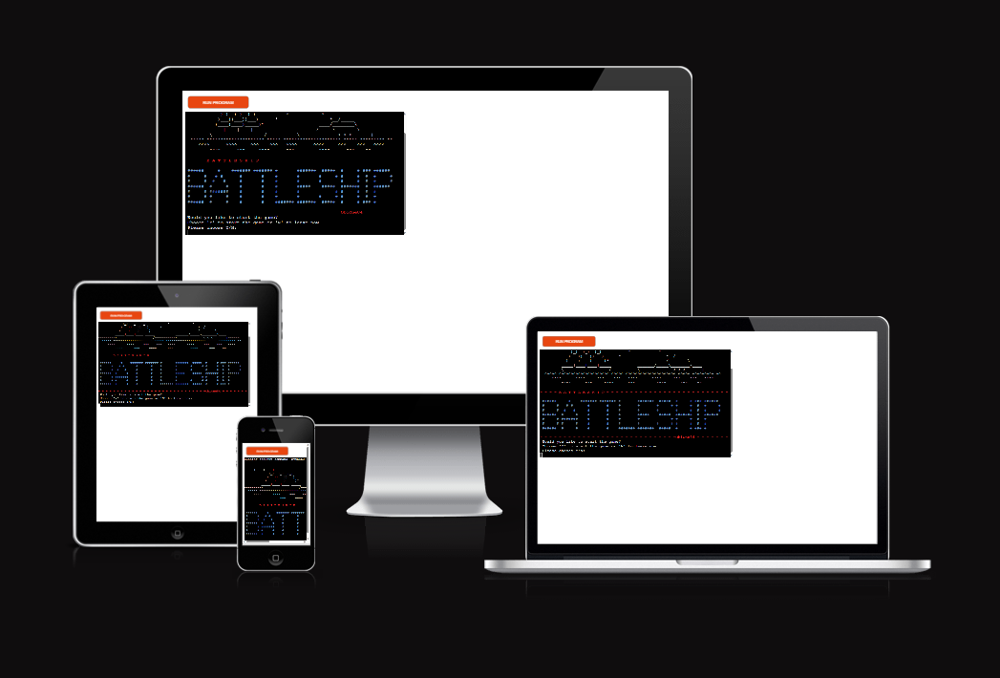
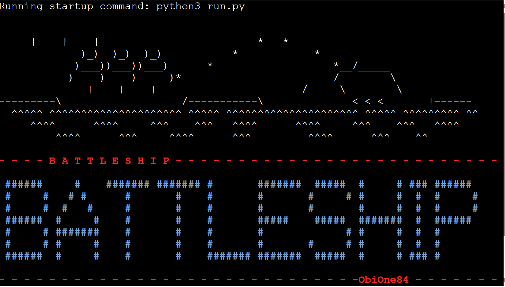
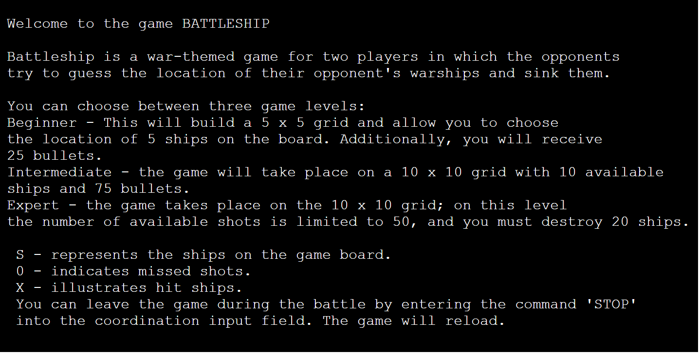
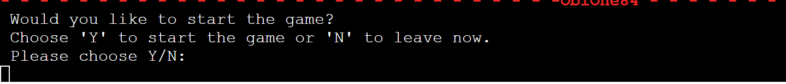
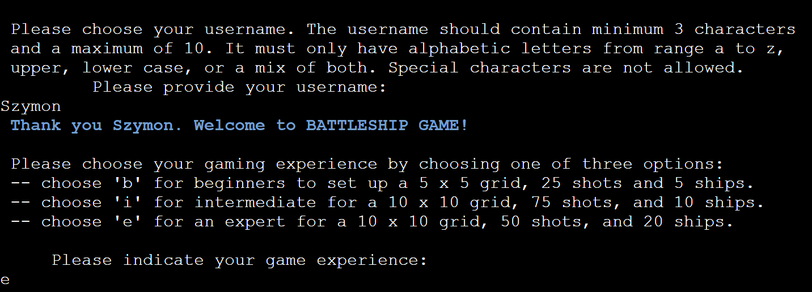
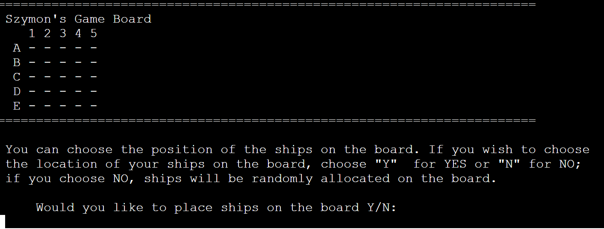

# BATTLESHIP GAME #
The BATTLESHIP Game is a terminal game which runs in the Code Institute mock terminal on Heroku. The user can challenge the computer in a one-on-one battle but choose one of three challenging levels. A beginner level lets users get familiar with the interface and understand simple game rules. At this level, users have 25 shots available to hit 5 ships. The game board size is reduced to 25 fields, which increases winning chances. An intermediate level builds a 10 by 10 grid, providing 10 boats and 75 shots. Lastly, an expert level utilises the same grid size as the intermediate, but the user has only 50 attempts to hit 20 ships.
Additionally, users can choose between random allocation of ships on the board or manual placement. Moreover, the game consists of many visual additions like game logos, color fonts and line separators to improve user experience. Lastly, the game provides countless hours of fun and entertainment by challenging the user's luck.

Click [HERE](https://battleship-game-one-6bf6c6bf7e50.herokuapp.com/) to visit a live page.

---

---

## How To Play ##

BATTLESHIP Game is heavily based on traditional pen-and-paper games. The main goal is to destroy all opponent's ships. You can read more about the game on [TheSpruceCRAFTS](https://www.thesprucecrafts.com/the-basic-rules-of-battleship-411069). In this version, users enter their name, which consists of alphabetic letters. Furthermore, users are prompted to choose a difficulty level - this will determine the grid size, num of ships, and shots. 
A beginner level generates a 5 x 5 game board with five boats and 25 available shots. At the intermediate level, users have 10 available ships and 75 bullets, and the game takes place on a 10 x 10 board. Also, an expert level generates a 10 x 10 game board, but users have only 50 shots to destroy 20 boats on this level. Lastly, the user can choose between manual boat placement on the board or random allocation. 
The players can see the location of their ships, which are marked on the board with S. The computer's ships are hidden from the users. The guesses are marked with an X on the board, and misses are marked with a 0. 
To place the ships or shot at the board, players must pass coordinates in the format of 'A1' where A - represents the row name and 1 - the column number. Players win by destroying all of the opponent's ships. 

---

## Features ##

### Current Features ###

1. Game Logo.
    - The users are presented with the game logo at the start of the game.

 

2. Game Intro.
    - Introduces the basic game rules to the user
    - Explains the different game difficulity levels
    - Explains game markings

2. User decisions.

    1. Start the game:
    - Accepts user`s input
    - The users must enter 'Y' or 'y' to start the game. If user choose 'N' or 'n', the game will reload 
    
    ---
    2. User must choose username and game level
    - Accepts user`s input
    
    ---
    3. The user must decide to manually or randomly place ships on the board
    - Accept user`s input 
    - Prints user`s board
    
