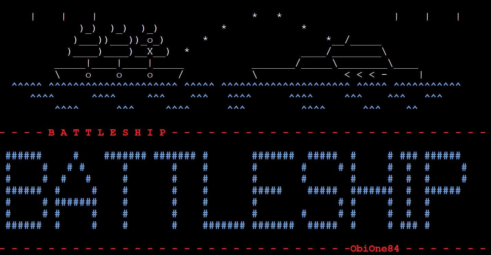

# BATTLESHIP GAME #
The BATTLESHIP Game is a terminal game which runs in the Code Institute mock terminal on Heroku. The user can challenge the computer in a one-on-one battle but choose one of three challenging levels. A beginner level lets users get familiar with the interface and understand simple game rules. At this level, users have 25 shots available to hit 5 ships. The game board size is reduced to 25 fields, which increases winning chances. An intermediate level builds a 10 by 10 grid, providing 10 boats and 75 shots. Lastly, an expert level utilises the same grid size as the intermediate, but the user has only 50 attempts to hit 20 ships.
Additionally, users can choose between random allocation of ships on the board or manual placement. Moreover, the game consists of many visual additions like game logos, color fonts and line separators to improve user experience. Lastly, the game provides countless hours of fun and entertainment by challenging the user's luck.

Click [HERE](https://battleship-game-one-6bf6c6bf7e50.herokuapp.com/) to visit a live page.

---

---

## How To Play ##

BATTLESHIP Game is heavily based on traditional pen-and-paper games. The main goal is to destroy all opponent's ships. You can read more about the game on [TheSpruceCRAFTS](https://www.thesprucecrafts.com/the-basic-rules-of-battleship-411069). In this version, users enter their name, which consists of alphabetic letters. Furthermore, users are prompted to choose a difficulty level - this will determine the grid size, num of ships, and shots. 
A beginner level generates a 5 x 5 game board with five boats and 25 available shots. At the intermediate level, users have 10 available ships and 75 bullets, and the game takes place on a 10 x 10 board. Also, an expert level generates a 10 x 10 game board, but users have only 50 shots to destroy 20 boats on this level. Lastly, the user can choose between manual boat placement on the board or random allocation. 
The players can see the location of their ships, which are marked on the board with S. The computer's ships are hidden from the users. The guesses are marked with an X on the board, and misses are marked with a 0. 
To place the ships or shot at the board, players must pass coordinates in the format of 'A1' where A - represents the row name and 1 - the column number. Players win by destroying all of the opponent's ships. 

---

## Features ##

### Current Features ###

1. Game Logo:
    - The users are presented with the game logo at the start of the game.

 

2. Game Intro:
    - Introduces the basic game rules to the user
    - Explains the different game difficulty levels
    - Explains game markings

2. User decisions:

    1. Start the game:
    - Accepts user's input
    - The users must enter 'Y' or 'y' to start the game. If the user chooses 'N' or 'n', the game will reload 
    - Loads the game
    
    - Validates the user's choice
    ---
    2. User must choose a username and game level
    - Accepts user's input
    - Sets username
    - Defines game parameters (board size, number of ships and shots)
    
    - Validates the user's choice
    ---
    3. The user must decide to manually or randomly place ships on the board
    - Accepts user's input 
    - Prints user's board
    
    - Validates the user's choice
    ---
    4. The users must decide if they want to continue the game when they do not have enough bullets to destroy all remaining ships.
    - Accepts users` input
    - Returns to the game or reloads the game - depending on the user's decision
    
    - Validates the user's choice
    ---
    5. Users must decide whether to continue the game once they win or lose it.
    - Accepts user's input
    - Reloads the game from the game level choice

    ---

3. Feedback messages:
  - In-game feedback messages are printed in blue to confirm the user's decision choice
  - Feedback answer to Yes or No decision, username choice, game level.
  
  - Hit shots are printed in green to inform users about successful shot
  - Missed shots are printed in red to inform users

4. Manual placement of ship on the board:
  - Prints empty user's board
  - Accepts user's input
  - Adds ships to the board 'S'
  - Informs users about the successful placement of the ship on the board
  - Informs users about remaining ships to place
  
  - Validates the user's choice
  - User must provide coordinates within the gameboard and in the correct format
  

---

5. Random ship placement on the user's board:
  - Prints user's board with ships randomly placed (example below - game level expert)
  

---

6. Battle mode:
  - Accepts user's input 
  - Users shot at the computer board (marked in yellow ink)
  
  - Prints feedback message for each hit in bright green color, for each missed in bright red color
  - Confirms users' and computer choices by repeating users` choice
  - Calculates remaining shots and ships
  - Displays the beginning and end of each round
  - Informs user about the possibility of leaving the game early by typing 'stop' into the coordination field at any time of the game - the game will restart
  - Ships are randomly placed on the computer board
  - Hides the location of computer ships
  - Computer shots randomly at the users` board
  - Displays hits on the board as 'X'
  - Displays misses on the board as '0'
  
  - Validates users` input

---

7. Winner's message and trophy:
  - Users receive congratulatory messages after destroying all computer ships
  - Users are presented with a bright yellow trophy and the message YOU WIN
  - Users are asked if they wish to continue the game, the game will restart, and the user can choose a difficult level
  - Validates users` input
  

---

8. Game over message:
  - When user fails to destroys all computer ships, the game over message will appear on the screen
  
